# Bashkit4j

[](https://central.sonatype.com/artifact/io.github.terseprompts/bashkit4j)
[](https://javadoc.io/doc/io.github.terseprompts/bashkit4j)
[](https://github.com/tersePrompts/bashkit4j/actions/workflows/test.yml)
[](LICENSE)
[](https://github.com/tersePrompts/bashkit4j/stargazers)

**Run untrusted bash inside your JVM. No real bash. No host access. No Docker.**

Bashkit4j is a Java SDK for executing shell scripts in a **sandboxed virtual
computer**: a POSIX-style bash with 160+ commands (`grep`, `sed`, `awk`, `jq`,
`tar`, `find`, …) re-implemented in Rust, an in-memory virtual filesystem, and
a network-denied-by-default execution model — all behind a small, typed Java
API. The script gets a computer that doesn't exist. Your machine stays yours.

<p align="center">
  
</p>

Give it a real job — analyzing your project with **read-only eyes**, writing
conclusions into its own memory:

```java
try (Bash bash = Bash.builder()
        .allowMountsUnder("C:/dev/my-app")                     // opt in: all it may ever see
        .mount("/project", "C:/dev/my-app")                    // mount your project — read-only
        .file("/notes.txt", "todo-review\nscratch\n")          // its own in-memory scratch space
        .build()) {

    bash.exec("grep -rn TODO /project/src | head -5");         // real files, zero risk
    bash.exec("sort /notes.txt | tr a-z A-Z > /out.txt");      // writes stay in the sandbox
    System.out.println(bash.readFile("/out.txt"));             // ...and you read them back
} // close() frees it. Your disk was never writable. No process was ever spawned.
```

## Add the dependency

**Maven**

```xml
<dependency>
    <groupId>io.github.terseprompts</groupId>
    <artifactId>bashkit4j</artifactId>
    <version>0.2.0</version>
</dependency>
```

**Gradle**

```groovy
implementation 'io.github.terseprompts:bashkit4j:0.2.0'
```

That's the whole install story: **Java 17+**, one artifact on
[Maven Central](https://central.sonatype.com/artifact/io.github.terseprompts/bashkit4j).
Native libraries for Windows, Linux and macOS (x86-64 + ARM64) are bundled
inside the jar and auto-detected at load time — no Docker daemon, no bash
binary on the host, nothing else to provision. Browse the
[Javadoc](https://javadoc.io/doc/io.github.terseprompts/bashkit4j).

---

## Why this exists

Every app eventually shells out — build steps, user automation, AI agents with
a "terminal". The standard toolkit makes that a security decision:

| | `ProcessBuilder` / `Runtime.exec()` / Docker | **Bashkit4j** |
|---|---|---|
| Real bash on the host | ✅ runs — full attack surface | **❌ never — bash is re-implemented in the library** |
| Host filesystem visible to the script | ✅ yes | **❌ invisible — scripts see only the in-memory VFS** |
| OS processes spawned per command | ✅ one per call | **❌ zero — everything runs in-process** |
| Network access | ✅ open by default | **❌ denied by default** |
| Startup cost | seconds (container) | **milliseconds (in-process)** |
| Multi-tenant isolation | roll your own | **built-in — one instance = one tenant** |

> **Before:** every bash command is a new OS process; one rogue script is a
> node down.
> **After:** zero OS processes, zero blast radius.

Running untrusted code with trusted permissions is a bet you lose eventually.
Bashkit4j takes the permissions away instead.

---

## The API tour

Everything goes through one entry point: `Bash.builder()`. Configure a sandbox,
run scripts, read results, throw it away.

### 1 · Configure a sandbox — the builder

```java
try (Bash bash = Bash.builder()
        .cwd("/workspace")                     // virtual working directory
        .username("agent").hostname("sandbox") // virtual identity for whoami/id/$USER
        .env("CI", "true")                     // environment variables
        .file("/workspace/app.conf", "debug=1")// pre-seeded files (text)
        .maxCommands(1000)                     // resource limits
        .timeoutMs(30_000)                     // wall-clock cap per exec call
        .build()) {
    // every instance is fully isolated — nothing is shared between instances
}
```

State (variables, files, cwd) persists across `exec` calls **within** one
instance, and provably cannot leak **across** instances.

### 2 · Run scripts, get typed results

```java
ExecResult ok = bash.exec("echo hi && grep -r TODO .");
// ExecResult = stdout, stderr, exitCode, stdoutTruncated, stderrTruncated,
//              finalEnvJson (exported vars, when capture_final_env is on)

ExecResult fail = bash.exec("exit 7");
fail.exitCode();               // 7 — non-zero exit is a normal result, not an exception

bash.execOrThrow("false");     // throws BashException (message = stderr) on non-zero
```

Runaway scripts don't take the instance down with them. `timeoutMs` caps each
`exec` call on the wall clock; `cancel()` stops a running script from any
thread — a cancelled agent turn doesn't have to wait for its command to exit:

```java
// .timeoutMs(5000) on the builder: a stuck script throws instead of hanging forever
try {
    bash.exec("while true; do :; done");   // throws BashException: execution timeout
} catch (BashException e) { /* instance stays usable */ }

Thread canceller = new Thread(() -> {
    try { Thread.sleep(200); } catch (InterruptedException ignored) { }
    bash.cancel();                          // abort lands at the next command boundary
});
canceller.start();
bash.exec("while true; do :; done");        // throws BashException (status 7 = cancelled)
canceller.join();
bash.clearCancel();                         // flag is sticky — reset before the next exec
```

### 3 · Drive the virtual filesystem from Java

```java
bash.writeFile("/data/config.json", "{\"debug\":true}");   // strings…
bash.writeFile("/data/blob.bin", new byte[]{0, 1, (byte)0xff}); // …or exact bytes
String cfg = bash.readFile("/data/config.json");
byte[] raw = bash.readFileBytes("/data/blob.bin");
bash.mkdir("/tmp/work", true);
bash.remove("/tmp/work", true);
```

Scripts and your Java code share the same virtual filesystem — hand data in,
get results out, no temp files on the host.

### 4 · Mount a real host directory (opt-in, allowlisted)

The default sandbox sees **no** host paths. When a script genuinely needs your
files, mount them deliberately:

```java
try (Bash bash = Bash.builder()
        .allowMountsUnder("C:/dev/projects")             // what MAY be mounted
        .mount("/workspace", "C:/dev/projects/my-app")   // read-only mount
        .build()) {
    bash.exec("ls /workspace && cat /workspace/README.md");

    bash.mount("/data", "C:/dev/data", true);            // live mount, writable
    bash.exec("grep -r TODO /data | head");
    bash.unmount("/data");                               // shell state preserved
}
```

- The allowlist is enforced **inside the native library**: mount roots are
  canonicalized, so `..` segments and symlink tricks can't escape an
  allowlisted prefix, and every mount (builder-time or live) must resolve
  under one.
- No `allowMountsUnder(...)` → no mounts, ever. The sandbox stays airtight by
  construction.

### 5 · Runtime info for health checks

```java
BashkitRuntime.library();            // load + cache the native lib (JNA)
BashkitRuntime.abiVersion();         // guards the C ABI contract (1)
BashkitRuntime.version();            // native engine version
BashkitRuntime.capabilitiesJson();   // {"abi":1,"features":["git","jq","vfs","realfs-mounts"]}
BashkitRuntime.supports("realfs-mounts"); // feature-detect without hard failure
```

---

## What the sandbox actually does (measured, not claimed)

Bashkit4j ships **51 tests** (`mvn test`) that run against the real native
library on Windows, Linux and macOS — including deliberate escape attempts:

| Probe | Result |
|---|---|
| `ls /` | Only the virtual `dev home tmp` |
| `test -e /etc/passwd` | `no-passwd` — host files unreachable |
| `test -f C:/Windows/win.ini` | `no` — host (Windows) paths unreachable |
| `ls / ../..` | Same listing — `..` cannot escape |
| `curl https://example.com` | `network access not configured` |
| `id` | `uid=1000(sandbox)` — a virtual identity, not your OS user |
| Two instances, different env | Each sees only its own variables |
| Mount + `cat /data/../secret.txt` | Blocked — traversal cannot leave the mount root |
| Write to a read-only mount | Fails; host file provably never appears |
| `.timeoutMs(500)` + `sleep 30000` | `BashException` ("execution timeout"); instance still usable |
| `cancel()` from another thread mid-script | Script aborts at the next command boundary, status 7 |

---

## Who it's for

- **AI/LLM engineers** — give a coding agent a real terminal (`ls`, `cat`,
  `grep`, `tar`, `jq`, …) without letting it touch the machine running it.
  Deterministic `close()`, per-tenant isolation, resource limits.
- **SaaS / multi-tenant platforms** — run user-supplied scripts or "serverless
  functions" fully isolated, one `Bash` instance per tenant.
- **Security-conscious teams** — anything that used `ProcessBuilder` or
  `Runtime.exec()` gets a sandbox instead of a raw process, for free.
- **CI / automation tooling** — replace shell-in-Docker setups with an
  in-process shell that starts in milliseconds and needs no daemon.

---

## Requirements & platforms

Just **Java 17+**. The native engine is bundled in the jar and auto-detected:

| Platform | Library |
|---|---|
| Windows x86-64 | `bashkit.dll` |
| Linux x86-64 | `libbashkit.so` |
| Linux ARM64 | `libbashkit.so` |
| macOS x86-64 | `libbashkit.dylib` |
| macOS ARM64 | `libbashkit.dylib` |

Resolution order: system property `-Dbashkit.native.path` → env var
`BASHKIT_NATIVE_PATH` → bundled auto-detect → platform `java.library.path`.

---

## Honest caveats

- **Mounts are opt-in and allowlisted** (see above) — enabled by a small patch
  we maintain on the Bashkit C ABI
  ([`capi-host-mounts`](https://github.com/tersePrompts/bashkit/tree/capi-host-mounts)),
  being contributed upstream. Without `allowMountsUnder(...)` no host path is
  ever visible.
- `curl`/`wget` exist as commands but are **hard-unavailable** in this build —
  network stays denied; there is no `allowNetwork` escape hatch yet.
- Minor shell semantics worth knowing: `wc -l` counts newlines; `${#UNDEF}` is
  `0`; resource-limit overruns (including `timeoutMs` and `cancel()`) surface
  as `BashException`, not a non-zero `ExecResult`.
- `timeoutMs` and `cancel()` take effect at **command boundaries**. A timeout
  also interrupts a pending command (a stuck `sleep` dies with its deadline);
  a cancel does not — it waits for the running command to finish, so pair
  `cancel()` with `timeoutMs` to bound that wait. After a cancel, call
  `clearCancel()` (or discard the instance) before the next `exec`.

---

## Roadmap

- [ ] **M1** `BashTool` LLM/agent layer — tool metadata, input/output schema,
      `systemPrompt()`, typed errors.
- [x] **M2** Packaging — native libs bundled for 5 platforms, auto-detected;
      3-OS CI matrix.
- [x] **M3a** Host-directory mounts over the C ABI — opt-in, natively
      allowlisted (0.2.0); upstream contribution in progress.
- [x] **M3b** Execution controls over the C ABI — wall-clock `timeoutMs` and
      `cancel()`/`clearCancel()` (new `BASHKIT_CANCELLED` status), checked at
      command boundaries; same maintained-fork path as mounts.
- [ ] **M3c** Closer C-ABI gaps — JNI for streaming output, custom builtins,
      snapshots.
- [x] **M4** Published to Maven Central —
      [io.github.terseprompts:bashkit4j](https://central.sonatype.com/artifact/io.github.terseprompts/bashkit4j).

---

## Building from source

You normally don't need this — the artifact is on Maven Central with all
native libraries bundled.

```bash
git clone https://github.com/tersePrompts/bashkit4j.git
cd bashkit4j
mvn test          # 51 tests against the real native library
mvn -q compile exec:java   # runnable demo, including a live host-mount
```

---

## License

[MIT](LICENSE). Bashkit4j is an independent Java binding of
[everruns/bashkit](https://github.com/everruns/bashkit) (MIT); the bundled
native libraries are built from [our fork](https://github.com/tersePrompts/bashkit)
of that project and distributed under the same license. See [NOTICE](NOTICE)
for attribution and terms.
